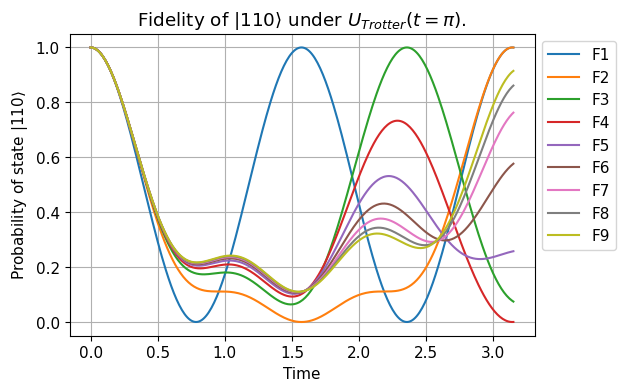

<!-- Badges: -->
[](https://www.paypal.me/CamponogaraViera/100)
[](https://colab.research.google.com/github/QuCAI-Lab/ibm2021-open-science-prize/blob/dev/simulation.ipynb)
[](https://github.com/QuCAI-Lab/ibm2021-open-science-prize/blob/dev/LICENSE.md)
[](https://github.com/QuCAI-Lab/ibm2021-open-science-prize/pulls)
[](https://github.com/QuCAI-Lab/ibm2021-open-science-prize/graphs/commit-activity)
[](https://github.com/QuCAI-Lab/ibm2021-open-science-prize/releases)

<!-- Logo: -->
<div align="center">
  <a href="https://qucai-lab.github.io/">
    
  </a>
</div>

<!-- Title: -->
<div align="center">
  <h1> <a href="https://research.ibm.com/blog/quantum-open-science-prize"> 2021 IBM Open Science Prize </a></h1>
  <h1> Simulating the XXX Heisenberg Model Hamiltonian for a System of Three Interacting Spin-1/2 Particles on IBM Quantum’s 7-qubit Jakarta Processor </h1>
</div>
<br> 

<div align="center">
The simulation presented here does not solve the challenge, however, the reader will find discussions on different approaches.
</div>
<br> 

<!-- Author: -->
<div align="center">
<b>Developers: ¹Lucas Camponogara Viera</b>
<br>
<b><a target="_blank" href="https://en.ntnu.edu.tw/">¹National Taiwan Normal University - NTNU, Taipei, Taiwan</a></b>.
</div>

<!-- Dependencies: -->
# Dependencies
<code>
<a href="https://www.python.org/" target="_blank" rel="noopener noreferrer"></a>
<a href="https://numpy.org/" target="_blank" rel="noopener noreferrer"></a>
<a href="https://matplotlib.org" target="_blank" rel="noopener noreferrer"></a>
<a href="https://qiskit.org/" target="_blank" rel="noopener noreferrer">
  <picture>
    <source media="(prefers-color-scheme: dark)" srcset="https://qiskit.org/documentation/stable/0.19/_static/logo.png">
    
  </picture>
</a>
</code>
<br>
<br>
  
For specific versions, see the [requirements.txt](requirements.txt) file.

<!-- Fidings: -->
# Preliminary Results 
  
View source code [here](https://github.com/QuCAI-Lab/ibm2021-open-science-prize/tree/dev/heisenberg_model/main). To know about the step-by-step simulation, one can resort to the [simulation.ipynb](simulation.ipynb) Jupyter notebook file and the corresponding [supplementary.ipynb](supplementary.ipynb) material for a skill reaffirming theoretical background.
    
    
Classical simulation shows that state fidelity does not increase with increasing number of Trotter steps given that $F_4(t=\pi)<F_3(t=\pi)<F_2(t=\pi)$. Classical simulation without noise also suggests a minimum number of $N_{\text{min}}=6$ Trotter steps ($F_6\approx 58$%) to comply with the competition judging criteria where the state fidelity is lower bounded at 30% for $N \geq 4$. A baseline number of $N=8$ Trotter steps is recommended according to simulations using the fake Jakarta backend. Since the simulation shown in the graph below considers a noise-free environment, the state fidelity is between two pure states (a.k.a state vectors). This contrasts with a noisy system that requires the evolved state to be represented by a [mixed density operator](https://qiskit.org/textbook/ch-quantum-hardware/density-matrix.html#:~:text=corrupted) (noise creates mixed states) and the state fidelity to be given in terms of the trace function. Recall that, although a mixed state (See Ref. [[1](https://doi.org/10.1017/CBO9780511976667)]) consist of an ensemble (statistical mixture) of N pure states denoted $|\psi\rangle$ in the state vector formalism, a mixed state cannot be represented by a linear combination of the aforementioned normalized state vectors (pure states) that are defined on a separable Hilbert Space.

  
<div align="center">
  <a href="https://raw.githubusercontent.com/QuCAI-Lab/ibm2021-open-science-prize/dev/assets/trotter_simulation.png?token=GHSAT0AAAAAABPWZEUSU25ZUS3OWDO47R4WYS5G7EQ"></a>
</div>  

- $F_1=0.9997172927505018$
- $F_2=0.9997173027412785$
- $F_3=0.07441607773249213$
- $F_4=0.00015902844790257657$
- $F_5=0.25775363032243465$
- $F_6=0.5765991261868874$
- $F_7=0.7625355067869187$
- $F_8=0.8611366833624895$
- $F_9=0.91466455372391$
  
<!-- Installation: -->
# First Steps

**Note: Windows users should replace "python3" with "python".**
  
1. Clone this repository and switch to cloned directory:
```bash
git clone https://github.com/QuCAI-Lab/ibm2021-open-science-prize.git && cd ibm2021-open-science-prize
```
2. Create a conda environment named "heisenberg-model" and activate it:
```bash
conda create -yn heisenberg-model python==3.7.13 && conda activate heisenberg-model
```
3. Install pip version 22.0.4 (latest version) in the current environment and check for updates:
```bash
conda install -yc conda-forge pip==22.0.4 && python3 -m pip install --user --upgrade pip
```
4. Install the `heisenberg-model` package with the required dependencies via the [requirements.txt](requirements.txt) file:
```bash
python3 -m pip install -v -e .
```
5. Check the package info:
```bash
conda list heisenberg-model
```

The `python3 -m pip install .` command is equivalent to the `python3 -m setup.py install` command.

- Flags: 
  - The -m flag in `python3 -m pip` enforce the pip version tied to the active environment, i.e, instructs python to run pip as the __main__ module (script).
  - The `--no-deps` flag ensures that `setup.py` will not overwrite the conda dependencies that you have already installed using the `environment.yml` file. In this case, the pip-equivalent packages specified in the `requirements.txt` file will not be used.
  - The `-e` flag stands for editable mode (recommended for developers). It installs the package without copying any files to the interpreter directory allowing for source code changes to be instantly propagated to the code library without the need of rebuild and reinstall, however, the python process/kernel will need to be restarted. It sets the pacakge info: Build dev_0 and Channel \<develop>. It also creates the `heisenberg-model.egg-info` file that enables the user to access the package information by: `conda list heisenberg-model`. For more information, see the setuptools [development mode](https://setuptools.pypa.io/en/latest/userguide/development_mode.html).
  - The `-v` flag enables progress display (verbose).
  
  
**Quick test-drive:**
```bash
python3 heisenberg_model/main/classical_simulation.py
>>> plot
```
```bash
python3 heisenberg_model/main/quantum_simulation.py
>>> State tomography fidelity on fake Jakarta backend = 0.3473 ± 0.0027
>>> State tomography fidelity on real Jakarta backend: Job in the queue...
```
**Alternatively, run the package:**
```bash
python3
```
```python
>>> import heisenberg_model as hm
>>> from qiskit.opflow import Zero, One
>>> import math
>>> hm.about()
>>> init_state=(One^One^Zero).to_matrix() # One can pass a numpy.ndarray as well.
>>> evolved=init_state
>>> csim=hm.ClassicalSimulation(trotter_steps=9, time=math.pi, measured_state=evolved, prepared_state=init_state)
>>> csim.run_classical()
>>> qsim=QuantumSimulation(trotter_steps=8, target_time=math.pi, reps=8, nshots=8192)
>>> qsim.fake_fidelity()
>>> qsim.real_fidelity()
```
  
# Project Description 

This repository features a quantum simulation proposed in the [2021 IBM Quantum Awards](https://ibmquantumawards.bemyapp.com/). The simulation presented here does not solve the challenge, however, the reader will find discussions on different approaches. The conundrum is to improve the state fidelity of the evolved quantum state starting from the initial state $|110\rangle$ to time t=π using Suzuki-Trotterization decomposition of the unitary time evolution operator under the XXX Heisenberg model Hamiltonian for a system of three interacting spin-1/2 particles ordered along a line (1D chain). The system of particles is to be represented by qubits 5, 3, and 1 in the IBM Quantum's 7-qubit Jakarta processor.   

In the noisy intermediate-scale quantum (NISQ) era, there are three main strategies for noise reduction. The first requires an understanding of material science, fabrication, and microwave engineering. The second focus on developing new circuits that are insensitive to noise, and the third strategy revolves around quantum error correction and quantum error mitigation. In the context of error correction, the remaining qubits (0, 2, 4 and 6) of the IBM Jakarta processor can be used as [ancillary](https://en.m.wikipedia.org/wiki/Ancilla_bit#Ancilla_qubits) qubits for realization of syndrome measurements that can reveal information about the noise in the system without collapsing the quantum state of the logical qubits that one wants to encode and protect against noise. Said measurements are tailored to the particular quantum error-correcting code of interest, for example, a parity measurement in a repetition code scheme. In a realistic scenario, however, syndrome measurements can also be noise prone. One of the drawbacks with the repetition code is its limitation in detecting only bit flip (X) errors in the Z-basis, as well as the requirement for qubits to be effectively ordered along a line. A workaround is the [surface code](https://journals.aps.org/pra/abstract/10.1103/PhysRevA.86.032324) to detect both bit-flip (X) errors using plaquete syndrome and phase-flip (Y) errors using a vertex syndrome. 
  
An alternative to error correction is error mitigation. One example is the statistical method known as Clifford Data Regression (CDR) [[2](http://dx.doi.org/10.22331/q-2021-11-26-592)], a machine learning-based quantum error mitigation technique provided out-of-the-box in the open-source [mitiq library](https://mitiq.readthedocs.io/en/stable/guide/cdr.html). In the CDR workflow, several near-Clifford approximations of the target quantum circuit are rendered to both a classical simulator and a real quantum hardware. The expectation values obtained from the classical simulation (without noise) and real simulation (with noise) are then used as ground truth and prediction data (hypothesis), respectively, for the training dataset. One caveat: the CDR is conditioned by the fact that quantum circuits must be composed only by gates that can be efficiently simulated in a classical computer (see [Gottesman–Knill theorem](https://en.wikipedia.org/wiki/Gottesman%E2%80%93Knill_theorem)) in order to train the model in a noise-free environment. A workaround is to decompose the evolution operator with the Hamiltonian of interest into near-Clifford gates using operators (H, CNOT, S) that generate the SU(2) [Clifford group](https://en.wikipedia.org/wiki/Clifford_gates) plus the Pauli matrices (X, Y, Z) with the corresponding su(2) [Lie algebra](https://en.wikipedia.org/wiki/Special_unitary_group#Lie_algebra). Or even to use magic state distillation to implement non-Clifford gates protected from noise. Another approach to avoid magic state distillation might be to [combine both error correction and error mitigation](https://www.scientificamerican.com/article/how-to-fix-quantum-computing-bugs/).

It is also possible to take advantage of rotational symmetry using local operations (rotation gates). Recall that local operations are represented by [single-qubit gates](https://qiskit.org/documentation/stable/0.26/tutorials/circuits/3_summary_of_quantum_operations.html#Single-Qubit-Gates) and non-local operations are represented by [multi-qubit gates](https://qiskit.org/documentation/stable/0.26/tutorials/circuits/3_summary_of_quantum_operations.html#Multi-Qubit-Gates) (gates acting on multiple qubits, such as the CNOT gate). Believing that certain rotation paths in the Bloch sphere can be used to avoid noise, a gate $G$ can be given by the following similarity transformation: $RGR^{-1}=G$ iff $R$ and $G$ commute, where $R$ is the Unitary operator (another gate) performing an overall $2\pi$ rotation. Furthermore, if the two commuting matrices are Hermitian, they can be simultaneously diagonalized. Also, recall that Hermitian matrices remain Hermitian under unitary similarity transformations. Moreover, the operator $R$ can be used to find the eigenvectors and eigenvalues of the matrix $G$. With $R^{n}=\mathbb{I}$ (identity), linear algebra states that the eigenvalues of $R$ are [n-th roots of unity](https://en.wikipedia.org/wiki/Root_of_unity#General_definition) given by: $\lambda_k = e^{2πki/n}$, for $k=1,\cdots,n$ where $i$ is the imaginary unit.
  
For the future, this project proposes to investigate two approaches. The first is to design a feedforward neural network architecture to learn a denoising mapping function of the quantum system (hardware). The second approach is to frame the problem as an adaptive circuit, leveraging either a gradient-based ([parameter shift rule](https://pennylane.ai/qml/glossary/parameter_shift.html)) or a gradient-free ([rotoselect algorithm](https://pennylane.ai/qml/demos/tutorial_rotoselect.html)) optimization for tuning the Euler angles of the parametric quantum gates. 
 
## Baseline approach

The baseline approach take into consideration the following features and rule-of-thumbs to mitigate both gate errors and measurement errors during unitary decomposition into quantum gates and transpilation:

1. Choose the minimum number of Trotter steps that provide the desired state fidelity. 
2. Choose a decomposition where the evolution operator is decomposed into the least amount of native gates to minimize circuit depth and, therefore, gate error in the circuit. This is a challenge in itself.
3. For non-native gates, use the "conjugation by unitary" operation to represent some of the [conjugation by Cliffords](https://qiskit.org/textbook/ch-gates/proving-universality.html#4.1-Clifford-Gates-) in terms of tensor products of Paulis given the fact that Pauli gates share the same set of eigenvalues.
4. Whenever possible, apply 2-qubit gates between nearest neighbor qubits to avoid non-trivial transpilation (qubit routing).

In step 1, as the number of Trotter steps increases, the simulation becomes more accurate, however, the number of gate operations also increases adding more noise to the quantum circuit. This suggests a prior classical simulation to verify the evolution of the state fidelity as the number of trotter steps increases. In step 4, transpilation converts the gates in the circuit into the native gate set of the particular quantum hardware (processor). The trivial scenario is a Hadamard gate transpiled in terms of a single 1-qubit gate $U(\pi/2,0,\pi)$ with the given Euler angles ($\theta, \phi, \lambda$). However, when the circuit does not follow the hardware graph connectivity (coupling map), qubit routing is required. This procedure is commonly done by moving the state between two qubits using the 2-qubit SWAP gate which is a non-native gate (no direct implementation) in most quantum processors, thus requiring decomposition into CNOT gates. Hence, non-trivial transpilation add extra gates to the original circuit consequently increasing and delocalizing any noise already present. The solution is to avoid, whenever possible, multiple-qubit gates between any non-nearest neighbor physical qubits etched into the processor. 
  
  
# References &nbsp; <a href="#"></a> 
  
\[1] Nielsen MA, Chuang IL. 2010. Quantum Computation and Quantum Information. New York: [Cambridge Univ. Press.](https://doi.org/10.1017/CBO9780511976667) 10th Anniv. Ed. 
- Corollary 4.2, pg. 176: Gate decomposition.
- Theorem 4.3, pg. 207: Trotter formula. 
- Chapter 4.7.2, pg. 206: The quantum simulation algorithm. 
- Chapter 9.2.2, pg. 409: State fidelity.
  
\[2] Griffiths, David J., and Darrell F. Schroeter. Introduction to quantum mechanics. Cambridge University Press, 2018.
- Section 3.2.3, pg. 103: scalar wave function.

\[3] [ibmq-qsim-challenge.ipynb](https://github.com/qiskit-community/open-science-prize-2021/blob/main/ibmq-qsim-challenge.ipynb).

\[4] [ibmq-qsim-sup-mat.ipynb](https://github.com/qiskit-community/open-science-prize-2021/blob/main/ibmq-qsim-sup-mat.ipynb).
  

# License

This work is licensed under a [Apache License 2.0](LICENSE.md) license.

<hr>

Created and maintained by [@camponogaraviera][1].

[1]: https://github.com/camponogaraviera
